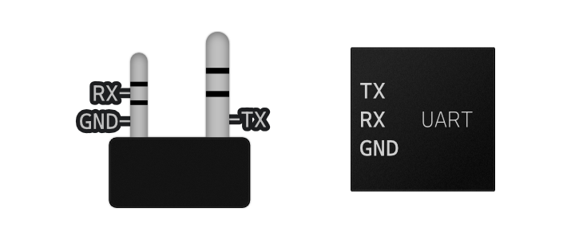
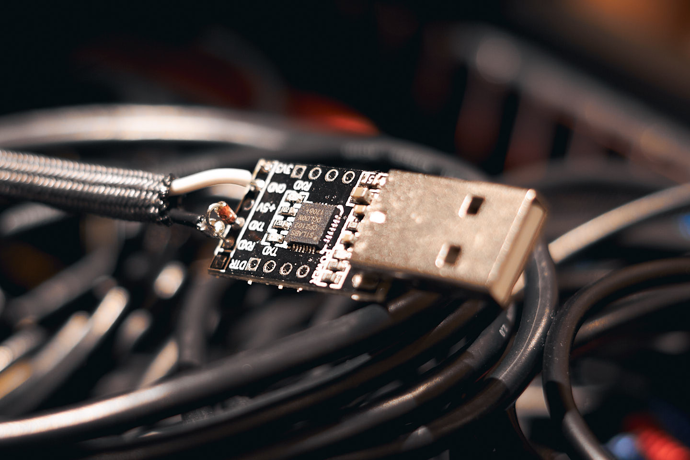

Do you want to program your radio from your computer but don't want to get ripped off with expensive programming cables from the manufacturer? In this article, you will find some great resources to build your own cables.

### Find a USB to Serial UART / TTL Dongle

I've had great success with a Silicon Labs CP2102 UART dongle. Many other UART chips on the market should work as well. For example the CP2102N or CP2104.

### Kenwood K1

One popular cable, the Kenwood K1 2-Pin is very easy to make and will program Kenwood HTs and many Chinese radios. 

Wire as described below:

**3.5 mm**  
Sleeve -> TXD

**2.5 mm**  
Ring -> RXD  
Sleeve -> GND

Programming software can be downloaded directly from Kenwood or use [CHIRP](https://chirp.danplanet.com/projects/chirp/wiki/Home) on compatible radios.

### ICOM OPC-478U

From N0DIM, the [DIY OPC-478U Radio Programming Cable](http://www.directdirt.com/2015/04/diy-opc-478u-radio-programming-cable-clone/) works great on a ton of Icom mobile radios and some Alinco radios. I used it on my Alinco DR-235 with [CHIRP](https://chirp.danplanet.com/projects/chirp/wiki/Home) and it made programming a breeze. For about $5 in parts that I had lying around, it sure beats the $67 asking price at my local dealer.

You can solder the diode and resistor directly to one of these dongles without any protoboard. I put the diode on top and the resistor on the bottom. Optionally cover with heat shrink tubing.