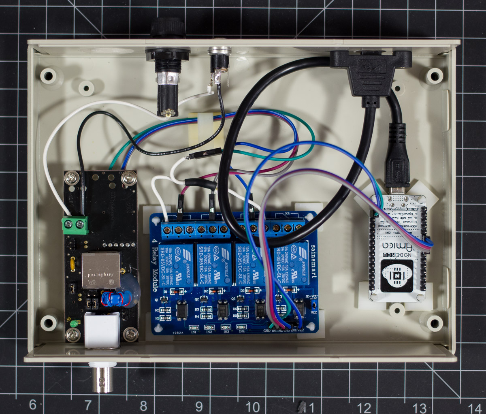
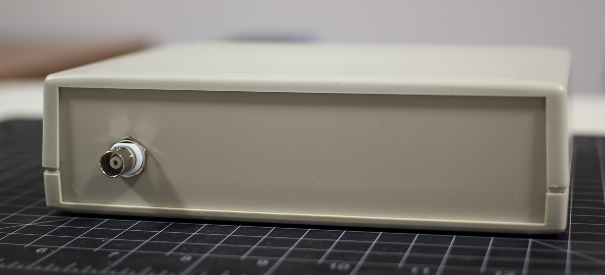
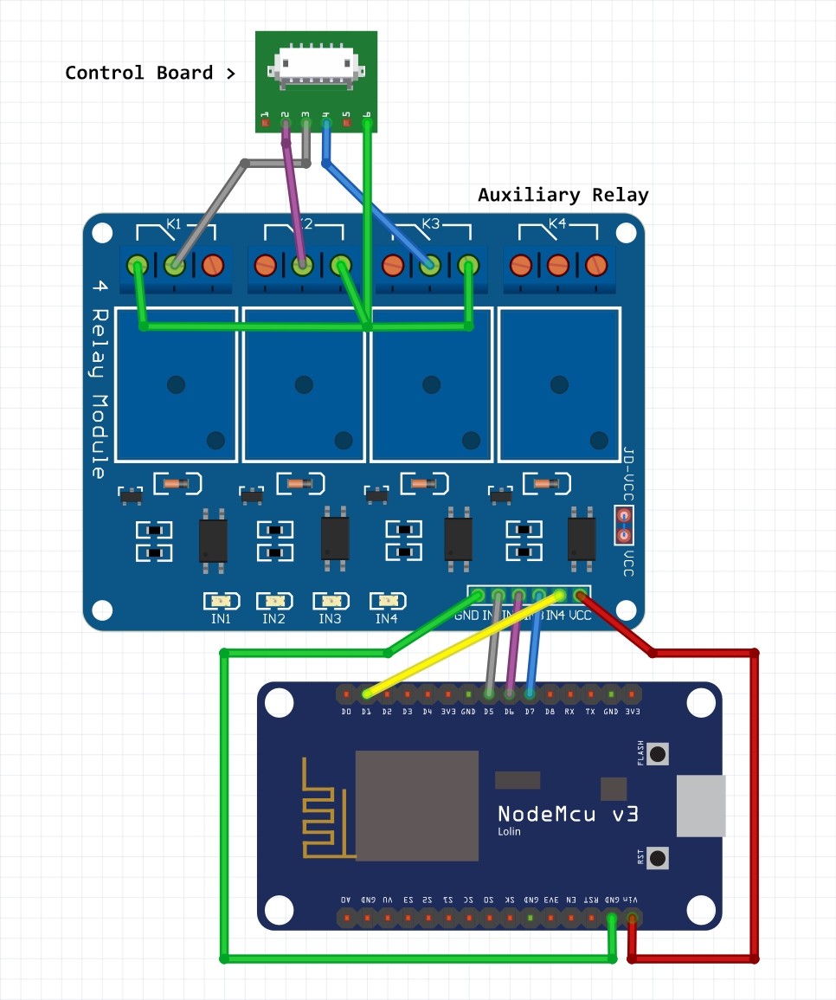
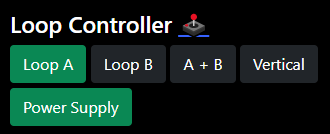

I wanted to build a fully remotable LZ1AQ Active Antenna controller with off the shelf components. It is very cheap to buy ESP8266 MCUs and multi-channel relay boards online. Why reinvent the wheel? This project can be easily adapted to control remote antenna switches and other devices that can be controlled with relays.

[View on Github](https://github.com/anthonydiiorio/LZ1AQ-Loop-Controller/)

## Wiring Diagram

## Usage

Navigate to http://loopcontroller.local/

### Auxiliary Relay

Relay 4 connects to pin D1 (GPIO 5)  
You can enable the 4th relay by setting `bool auxEnable = true;`  
You can invert the button color for normally closed by setting `bool auxNC = true;`  
You can set the button label by changing `const char *auxLabel = "Relay 4";`

I have mine set to power off the loop remotely wired in the normally closed position.

For additional relays I suggest using a project like [Tasmota](https://tasmota.github.io/docs/).

## Bill of Materials

| Part Number | Description | QTY |
|---|---|---|
| NodeMCU V2 | Microcontroller with ESP8266 | 1 |
| N/A | 4 Channel Relay Module (Active Low) | 1 |
| RM2055M | Hammond Enclosure (50 mm x 140 mm x 190 mm) | 1 |
| HC-6 | Adhesive PCB Supports | 8 |
| BK/HTB-24M-R | Fuse Holder 5mm x 20mm	| 1 |
| 5MF 300-R	| Fuse 300 mA 5mm x 20mm| 10 |
| N/A | DC Connector of your choice | 1 |
| N/A |Panel Mount Micro USB Extension | 1 |
| PGSD-8 | Cable Grommet | 1 |
| N/A | Hookup Wire | Lots |
| N/A | Dupont Jumpers Wires | Lots |

I used PC Motherboard standoffs and screws to rest the power inserter in the enclosure. It is not mounted permanently to allow easy removal of the front panel.

## LZ1AQ Documentation

1 0 0 Loop A  
0 1 0 Loop B  
1 1 0 A + B  
0 0 1 Vertical  

**Note: My code has pin 1 inverted so Loop A is in the Normally Closed position. This allows the loop to function in A mode with no power applied to the MCU or relay board.**

[LZ1AQ FAQ: Can the antenna switching be performed digitally?](http://active-antenna.eu/amplifier-kit/faq-aaa-1b/#antenna-swith)