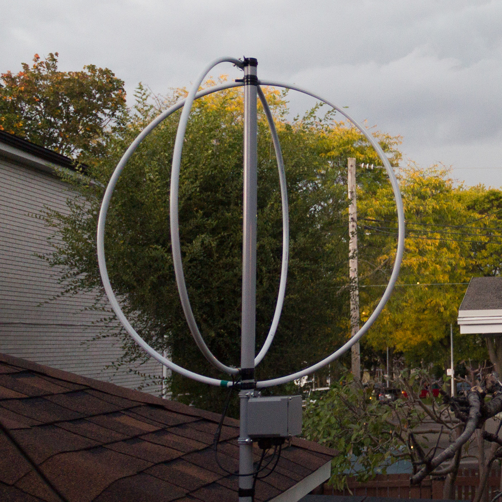
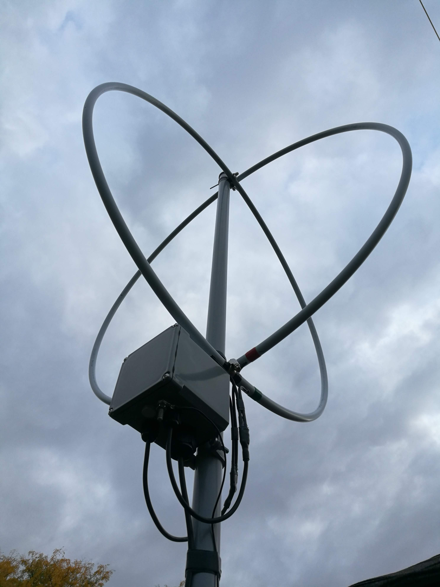
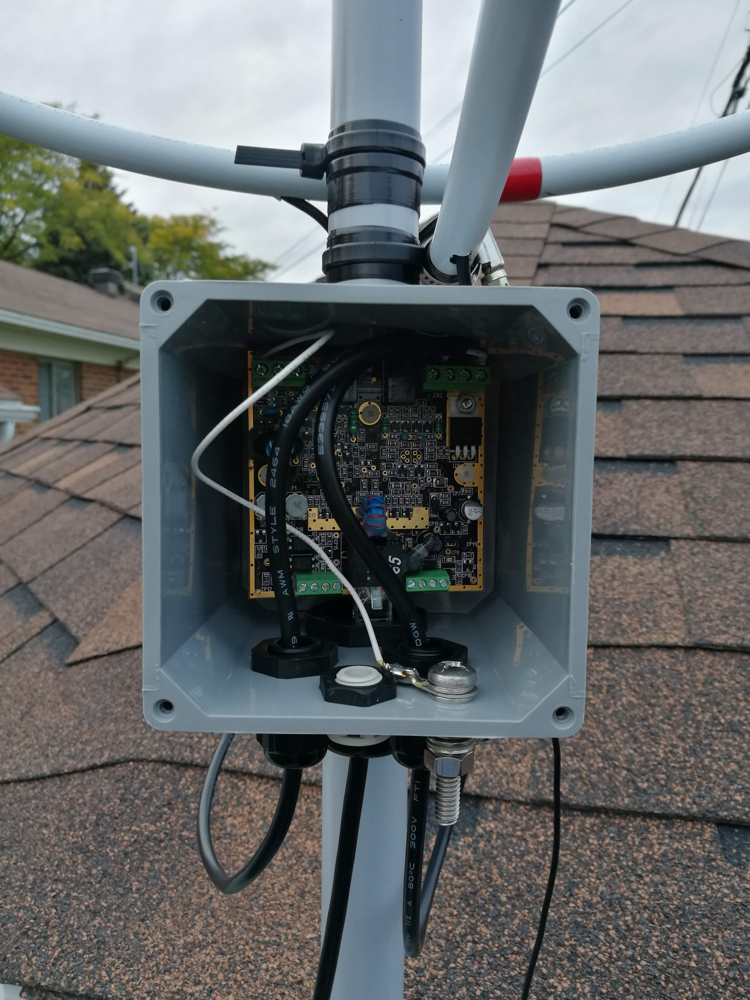

Finally had some time to install the loop outside. I was very impressed with it when I had it in prototype form indoors, but moving it outside really made a huge difference. The noise floor dropped, and sensitivity went through the roof on higher bands. There are signals I hear on the loop that don't exist on my transmit antenna.

## Enclosure Parts

| Part Number | Description | QTY |
|---|---|---|
| E987N-CAR | Carlon PVC Junction Box - 4x4x4 Inches | 1 |
| CCLP-200-B5 | Carlon Schedule 40 PVC Conduit Clamps 2 In | 2 |
| [VENT-PS1YGY-N8001](https://www.digikey.ca/en/products/detail/amphenol-ltw/VENT-PS1YGY-N8001/7898284) | Amphenol Vent With Nut | 1 |
| [5309 221](https://www.digikey.ca/en/products/detail/altech-corporation/5309-221/9377870) | Altech CABLE FDTHRU 7-16MM PG21 (Ethernet) | 1 |
| [7211 856](https://www.digikey.ca/en/products/detail/altech-corporation/7211-856/9378540) | Altech PG21 Locknut (Ethernet) | 1 |
| [5308 920](https://www.digikey.ca/en/products/detail/altech-corporation/5308-920/8546866) | Altech CABLE FDTHRU 2.5-8MM 3/8NPT POLY (Loops) | 2 | 
| [7211 495](https://www.digikey.ca/en/products/detail/altech-corporation/7211-495/8546901) | Altech LOCKNUT NYLON 3/8 NPT BLK (Loops) | 2 |
| [30-00350](https://www.digikey.ca/en/products/detail/tensility-international-corp/30-00350/5270206) | 2 Conductor 18 AWG Wire with PVC Jacket | 2 |
| N/A | Nuts and bolts for the optional vertical | |