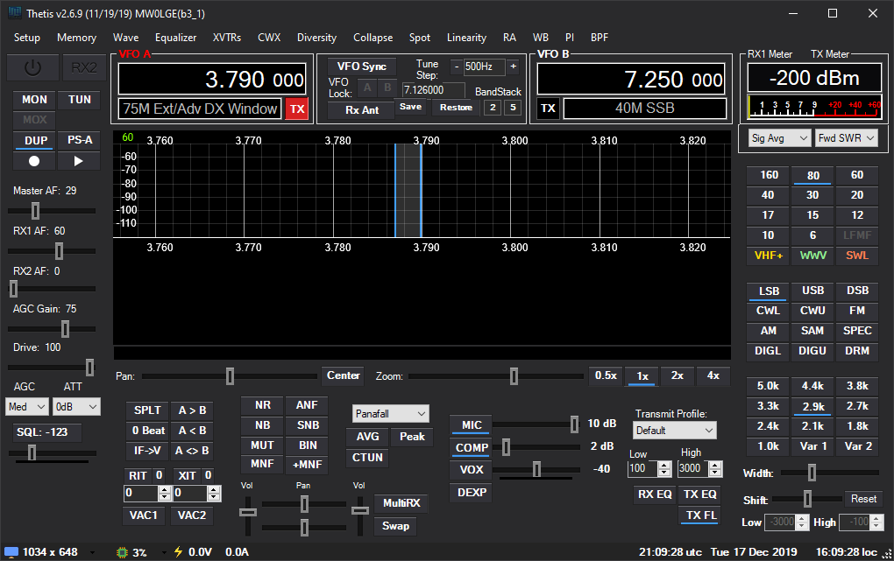

This is my first skin for PowerSDR, OpenHPSDR, Thetis, NaP3, etc. It's clean and simple. All the project files are in the repo for you to edit in Photoshop. I'll probably make some more as time allows.

[Download on GitHub](https://github.com/anthonydiiorio/PowerSDR-Skins/archive/refs/heads/master.zip)

### Setup -> Appearance 

#### General 

| VFO | RGB | Band Data |  RGB |
|---|---|---|---|
| Inactive | 255 255 255 | Inactive | 191 191 191 |
| Active | 255 255 255 | Active | 218 218 218 |
| Background | 0 0 0 | Out of Band | 105 105 105 |
| Small Color | 255 255 255 | Background | 0 0 0 |
| Info Color | 255 140 0 |

#### RX Display 

| Panadapter | RGB | Grid | RGB |
|---|---|---|---|
| Main RX Filter | 255 255 255 | Background | 0 0 0 |
| TX Filter | 64 159 255 | V-Grid | 255 255 255 |
| Band Edge | 255 0 0 | V-Grid Fine | 255 255 255 |
| MultiRX Filter | 64 159 255 | H-Grid | 255 255 255 |
| MultiRX Zero Line | 135 206 250 | Zero Line | 255 255 255 |
| GrayLine | 0 0 0 | Text | 255 255 255 |

| Cursor/Peak Readout | RGB |
|---|---|
| Peak Text | 30 144 255 |
| Background | 0 0 0 |

## Instructions

### PowerSDR, OpenHPSDR, Thetis

**Thetis:** copy skin folder to **`%AppData%\OpenHPSDR\Skins`**

**PowerSDR & mRX PS:** copy skin folder to **`%AppData%\FlexRadio Systems\PowerSDR\skins`**

Enable Skin: **`Setup -> Appearance -> General -> Skins`**

### NaP3

**Build:** Run **`Skin Folder\Console\Base\build-NaP3.bat`** to generate NaP3 skin

**NaP3:** copy skin folder to **`%ProgramFiles(x86)%\NaP3\Skins`**

Enable Skin: **`Setup -> Configure Nap3 -> Colours -> General -> Skins`**

### Modding

.PSD Files available in **`Skin Folder\Console\Base`**

Rebuild theme with **`build-PowerSDR.bat`** or **`build-NaP3.bat`**