The Retevis RT8 GPS is an inexpensive handheld radio with DMR digital voice capability, packed with many cool features, and very extensible with custom firmware.

- [Video Review](#video-review)
- [First Impressions](#first-impressions)
- [Programming](#programming)
- [GPS to APRS](#gps-to-aprs)
- [Custom Firmware](#custom-firmware)
- [Conclusion](#conclusion)

## Video Review


<iframe width="100%" height="404" src="https://www.youtube.com/embed/jrCehs_Tdo0" frameborder="0" allow="accelerometer; autoplay; encrypted-media; gyroscope; picture-in-picture" allowfullscreen></iframe>


## First Impressions

The RT8 has a solid plastic case with a nice finish. The radio is rated IP67 for dust and water resistance and has gaskets around the accessory port, battery, and battery contacts.

Included with the radio is a 2200 mAh battery, programming cable, desktop charger, belt clip, and an earpiece with a lock. The speaker mic connector is a Kenwood style.

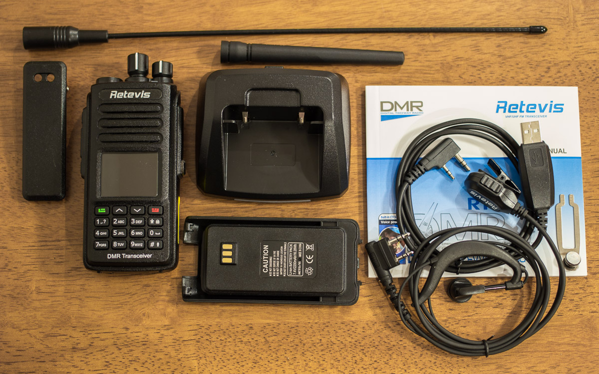

The radio also comes with two antennas. A short rubber duck, and a longer whip antenna. The radio has an SMA female connector, the antennas have SMA male connectors. Below are their measurements from a NanoVNA-H.

### Rubber Duck 4.75"

| Frequency | Return Loss | VSWR |
|-----------|-------------|------|
| 432.000 MHz | -11.69 dB | 1.70 |
| 446.100 MHz | -8.58 dB  | 2.19 |
| 450.000 MHz | -8.00 dB  | 2.32 |  

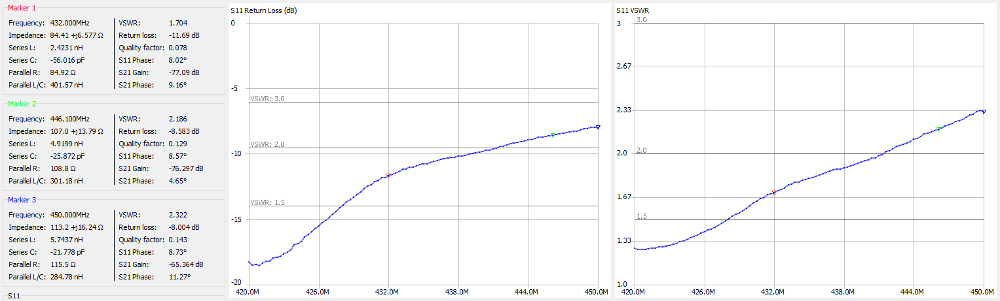

### Whip 13.5"

| Frequency | Return Loss | VSWR |
|-----------|-------------|------|
| 432.000 MHz | -14.15 dB | 1.49 |
| 446.100 MHz | -9.81 dB  | 1.96 |
| 450.000 MHz | -8.04 dB  | 2.31 |

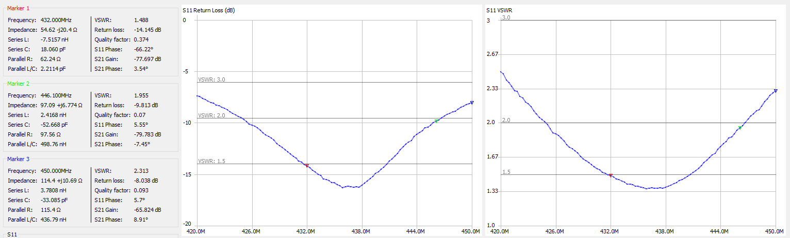

Both antennas are decent. About what you would expect from an HT antenna. The included whip resonates in the 70cm amateur band, so it would be the antenna to use in my opinion. And it will be much more efficient compared to the coiled up rubber duck antenna.

### Fit and Finish

The radio has a nice feel in the hand. It feels robust and has a nice weight. The knobs are smooth, and the buttons are nice and clicky. No mushy buttons here! The speaker is big, gets loud, and sounds great. Microphone audio is good too. Nice clear audio with good frequency response. Not muffled like other radios from overseas.

### Audio and Range Testing

<iframe width="100%" height="150" scrolling="no" frameborder="no" allow="autoplay" src="https://w.soundcloud.com/player/?url=https%3A//api.soundcloud.com/tracks/720158680%3Fsecret_token%3Ds-vJGp4&color=%23191a26&auto_play=false&hide_related=false&show_comments=true&show_user=true&show_reposts=false&show_teaser=true&visual=true"></iframe>

Analog audio is nice and smooth. About 300 - 4000 hz frequency response.  
DMR audio sounds good too. About 100 - 3850 hz frequency response.

<iframe width="100%" height="150" scrolling="no" frameborder="no" allow="autoplay" src="https://w.soundcloud.com/player/?url=https%3A//api.soundcloud.com/tracks/720158677%3Fsecret_token%3Ds-6pEpJ&color=%23191a26&auto_play=false&hide_related=false&show_comments=true&show_user=true&show_reposts=false&show_teaser=true&visual=true"></iframe>

Analog starts to break up on the frige, going in and out of the squelch and into the noise, while DMR continues to stay crystal clear. Very impressive!

## Programming

Download the latest programming software from [Retevis: Programming Software](https://www.retevis.com/resources-center)

Obtain a DMR ID from [RadioID.net](https://www.radioid.net/)

Programming a DMR radio is a little different than plain old analog FM. There are a few more things we need to include in a channel to get on the air, namely Color Code, Time Slot, and Talkgroup. A Color Code, or CC, is the DMR equivalent of a CTCSS tone. Time Slot, or TS, chooses TS1 or TS2 on a repeater. This allows two users to transmit on a repeater using [TDMA](https://en.wikipedia.org/wiki/Time-division_multiple_access). And finally, a Talkgroup, or TG, is like a virtual channel that many repeaters can link to. For example, you can have Talkgroups for local, regional, statewide, countrywide, worldwide, or special interest groups.

First open **General Settings** to enter your DMR Radio ID, and callsign. You will also need to set TX Preamble Duration to 960 ms. On this page you can also change from the default splash screen to a custom text display.

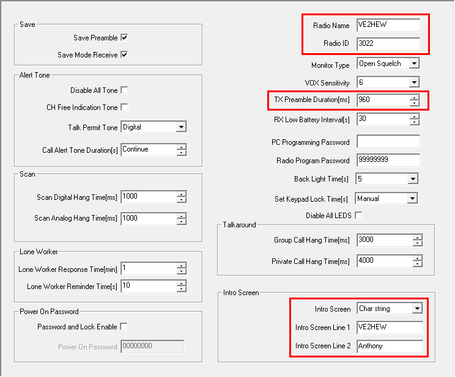

Next we'll find a repeater to connect to. There are multiple networks on DMR, Brandmeister, DMRPlus, and DMR-MARC. You can find a map/list of DMR repeaters here: [CQ DMR Map](http://cqdmrmap.com/), [DMR-MARC](https://dmr-marc.net/repeaters.html), [Brandmeister](https://brandmeister.network/?page=repeaters)

In this example, I found a local DMR-MARC repeater nearby on Mount-Royal. Since DMR-MARC repeaters are limited to the talkgroups set up by the repeater owner, programming is pretty straightforward. In this case, the repeater owner has listed all the available talkgroups, organized by timeslot. If not, you might try looking for a local DMR group website that lists available talkgroups in your area.

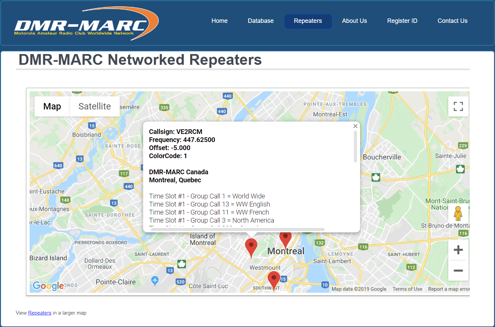

Next, add the available talkgroups to your **Digital Contacts** list.

Click **Add**, then fill in the **Contact Name**, and **Call ID** (TG). Make sure **Call Type** is set to **Group Call**. Private Calls are only used for repeater commands such as linking reflectors, status checks, or private calls to other users.

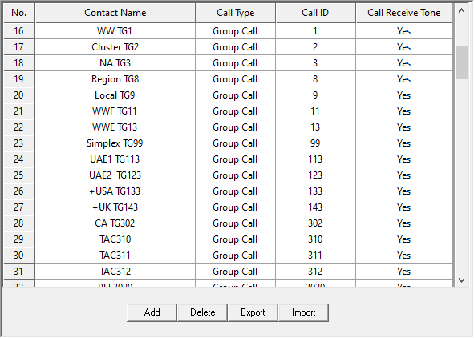

Next, create an **RX Group List** for each time slot, and add the appropriate talkgroups. This will allow you to hear active talkgroups. As an alternative, my preferred way to do this is using the md380tools custom firmware with promiscuous mode enabled. This saves lots of time programming and enables other useful features. 

_([See section on custom firmware](#custom-firmware))_

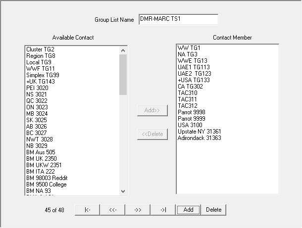

Now we can start creating channels! Right-click Channel Information and click Add. 

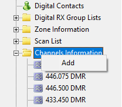

Set the following:

| Setting |  |
|---|---|
| **Channel Mode** | Digital | 
| **TOT (Timeout)** | 180 seconds  |
| **Channel Name** | Repeater / Talkgroup  |
| **RX Frequency** | Repeater Output Frequency |
| **TX Frequency** | Repeater Input Frequency |
| **Admit Criteria** | Color Code | 
| **Contact Name** | Digital Contact/Talkgroup | 
| **Group List** | RX Group, or none for automatic |
| **Color Code** | As described on repeater listing |
| **Repeater Slot** | Time Slot 1 or 2 |

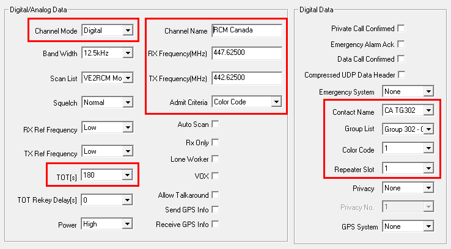

Repeat this for all the talkgroups you want.

Next, create a Zone for the repeater and add the channels in. I like to create a Zone for each Time Slot, or you can create a Zone 1 with commonly used talkgroups, and another for the rest. A Zone can only hold 16 channels.

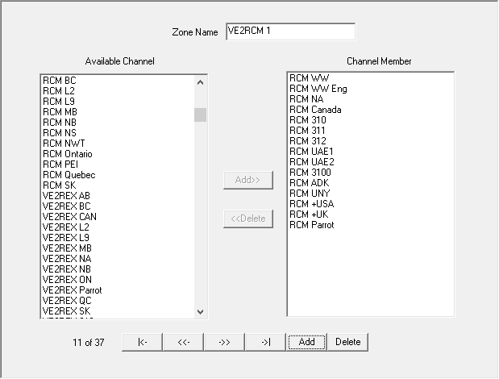

If you want to enable scanning, create a Scan List, add the channels you wish to scan, and then select the Scan List when editing a channel. You can also add analog channels to a Scan List.

### Brandmeister

For Brandmeister, you have free reign on what talkgroups you want to use and aren't at the mercy of a repeater/C-Bridge owner. Add talkgroups to your digital contacts list as you please.

You can find a list of talkgroups here: [Brandmeister: Talkgroups](https://brandmeister.network/?page=talkgroups)

Regular talkgroups are used on Time Slot 1, Local/Reflector is used on Time Slot 2. 

### Analog

Analog channels are programmed similarly. Just set the Channel Mode to Analog, Bandwidth to 25khz, TX/RX frequency, and enter the CTCSS info at the bottom.

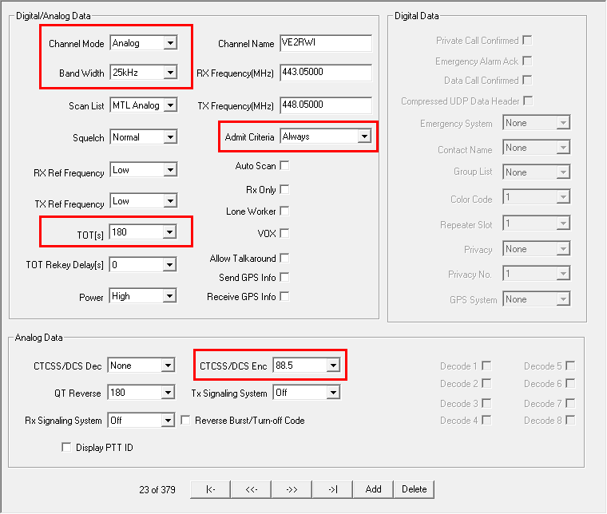

## GPS to APRS
Beaconing to APRS over Brandmeister is very easy. Add a digital contact for the APRS gateway, **310999** for USA servers, or **302999** for Canada. See the [Brandmeister Wiki](https://wiki.brandmeister.network/index.php/United_States_of_America) for other countries.

The **Call Type** must be set to **Private Call**.

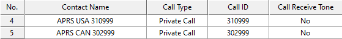

Next, go to **GPS System** in the sidebar, set the **GPS Report Interval**, and **Destination ID** to the APRS gateway for your country's master server.

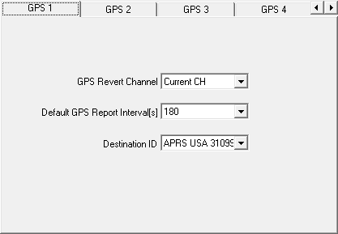

To enable beaconing, edit a channel to set the **GPS System** to the one you configured earlier. There is no need to enable Send GPS Info or Receive GPS Info. These settings will only send your GPS info to the talkgroup/contact you have selected. It does not forward GPS to the APRS gateway contact if you have a different contact/talkgroup selected. Keep this off to prevent unnecessary GPS transmissions after you unkey. 

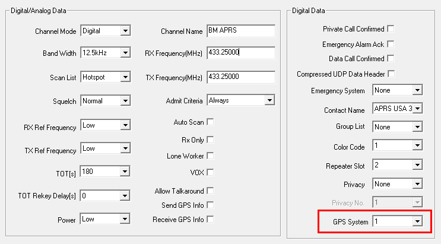

You can enable or disable beaconing on the radio on any channel in the settings.

**Menu > Utilities > Radio Settings > GPS > Select System**

### Brandmeister Selfcare

Navigate to [Brandmeister: SelfCare](https://brandmeister.network/?page=selfcare) to set up the APRS gateway.

Set your radio **Brand** to Chinese Radio, **APRS interval** to 60 sec, **APRS Callsign** to your [APRS SSID](http://www.aprs.org/aprs11/SSIDs.txt), and set **APRS Text** to your APRS Message. The APRS Text will also be used for Talker Alias on compatible radios.

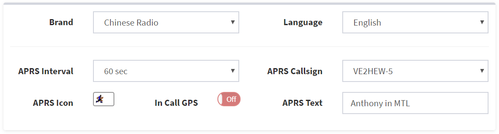

### APRS.fi

Once your radio locks to GPS and you're on a channel with a GPS System enabled, your APRS packets should start showing up on [APRS.fi](https://aprs.fi/)

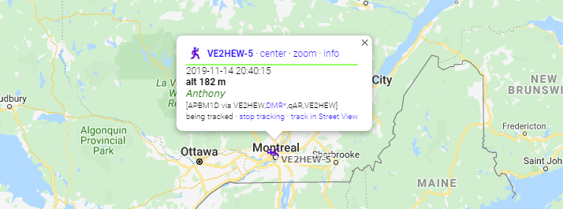

## Custom Firmware

One of the great reasons to choose a Retevis RT3/RT8 or TYT MD380/MD390 is the awesome custom firmware created by Travis Goodspeed called md380tools. It has excellent features that really make this radio work well for us amateur radio operators. 

My favorite features are the caller ID database for all registered users and promiscuous mode which enables you to receive anything that’s being transmitted on the time slot. This makes programming easy, especially on the Brandmeister network, where there are hundreds of talkgroups that you can access. Not only that, but you can hear talkgroups that you didn’t program into a receive group, so you can hear other people on the repeater on different talkgroups. This is especially handy to make sure you aren’t stepping on anyone’s conversation that you wouldn’t otherwise hear. Other nice features include last heard, mic bar graph, mic gain, extended channel info (frequency, talkgroup, timeslot), and more.

My preferred method of installation is KD4Z’s excellent Virtual Machine installer. It takes care of compiling the latest version, adding in some tweaks, and building a contact list. 

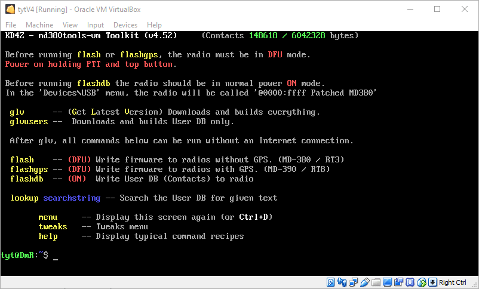

[GitHub: travisgoodspeed/md380tools](https://github.com/travisgoodspeed/md380tools)

[GitHub: KD4Z/md380tools-vm](https://github.com/KD4Z/md380tools-vm)

## Conclusion

The Retevis RT8 GPS is a pretty nice radio. Being a monobander with a superheterodyne receiver, it cuts above in performance compared to the dual-band alternatives. Audio quality is excellent for a handheld, and the build is very robust. Add in DMR, and you have a very inexpensive radio that does a whole lot. 

I would definitely recommend this radio, and installing the custom firmware!

### Availability
[Retevis](https://www.retevis.com/)

###### Disclosures

Retevis provided the RT8 sample for review. The opinions expressed in my review are my own based on my experience with the product. No one reviewed the content before it was posted, and I am not being compensated for my review.