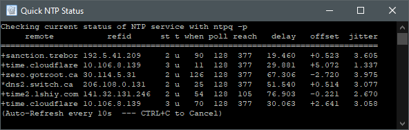

If you want to keep your computer clock perfectly in sync for digital modes, try these tools for Windows or Linux. Meinberg NTP and Chrony can use data from multiple sources to keep your clock precisely synchronized.

### Windows 🖥️

[Meinberg NTP](https://www.meinbergglobal.com/english/sw/ntp.htm) is an excellent free time synchronization software for Windows. It's super lightweight, consuming only 1 MB of RAM!

You can customize the config file to add your own list of servers.

I suggest using the [NTP Pool](https://www.ntppool.org/en/) or [Cloudflare Time](https://www.cloudflare.com/time/). 

You can find many quality public time servers from this list:  
[Github: 
mutin-sa/Public_Time_Servers.md ](https://gist.github.com/mutin-sa/eea1c396b1e610a2da1e5550d94b0453)

`C:\Program Files (x86)\NTP\etc\ntp.conf`

Run `Edit NTP Configuration` as Administrator

```
server 0.pool.ntp.org iburst minpoll 6 maxpoll 6
server 1.pool.ntp.org iburst minpoll 6 maxpoll 6
server 2.pool.ntp.org iburst minpoll 6 maxpoll 6
server 3.pool.ntp.org iburst minpoll 6 maxpoll 6
server time.cloudflare.com iburst minpoll 6 maxpoll 6
```
Then run `Restart NTP Service` as Administrator to apply your settings.

Run `Quick NTP Status` to view your connections:



### Linux 🖥️

[Chrony](https://chrony.tuxfamily.org/) is a high accuracy and very flexible implementation of Network Time Protocol (NTP). Chrony can work with an intermittent network connection, and can be used with external GPS devices. Very useful if you need to run FT8 portable!

#### Installation

```
# Debian/Ubuntu:
sudo apt install chrony

# Arch
pacman -S chrony

# RHEL/Fedora/CentOS
yum install chrony
```

#### Configuration

You can customize the config file to add your own list of servers.

I suggest using the [NTP Pool](https://www.ntppool.org/en/) or [Cloudflare Time](https://www.cloudflare.com/time/). 

You can find many quality public time servers from this list:  
[Github: 
mutin-sa/Public_Time_Servers.md ](https://gist.github.com/mutin-sa/eea1c396b1e610a2da1e5550d94b0453)

`/etc/chrony/chrony.conf`
```
pool pool.ntp.org iburst
pool time.cloudflare.com iburst
```
Then restart Chrony 

`systemctl restart chrony`

To view your connections run `chronyc sources -v`

```
$ chronyc sources -v
210 Number of sources = 5

  .-- Source mode  '^' = server, '=' = peer, '#' = local clock.
 / .- Source state '*' = current synced, '+' = combined , '-' = not combined,
| /   '?' = unreachable, 'x' = time may be in error, '~' = time too variable.
||                                                 .- xxxx [ yyyy ] +/- zzzz
||      Reachability register (octal) -.           |  xxxx = adjusted offset,
||      Log2(Polling interval) --.      |          |  yyyy = measured offset,
||                                \     |          |  zzzz = estimated error.
||                                 |    |           \
MS Name/IP address         Stratum Poll Reach LastRx Last sample
===============================================================================
^- 0.ca.pool.ntp.org             3  10   377   805  -4085us[-4085us] +/-   40ms
^- 1.ca.pool.ntp.org             2  10   377   806  -1674us[-1674us] +/-   45ms
^- 2.ca.pool.ntp.org             2  10   377   24m  -4359us[-4359us] +/-   57ms
^* 3.ca.pool.ntp.org             2  10   377   45m  -4140us[-4083us] +/-   13ms
^- time.cloudflare.com           3  10   377   378  -1669us[-1669us] +/-   40ms
```
To check if your computer is synchronized, run `chronyc tracking` 

```
$ chronyc tracking
Stratum         : 2
Ref time (UTC)  : Fri Mar 18 19:43:43 2022
System time     : 0.000277688 seconds fast of NTP time
Last offset     : +0.000283455 seconds
RMS offset      : 0.000479173 seconds
Frequency       : 64.315 ppm fast
Residual freq   : +0.004 ppm
Skew            : 0.241 ppm
Root delay      : 0.010316090 seconds
Root dispersion : 0.000191347 seconds
Update interval : 258.0 seconds
Leap status     : Normal
```

### Done 😁

Congratulations, now you can run FT8 in perfect sync!